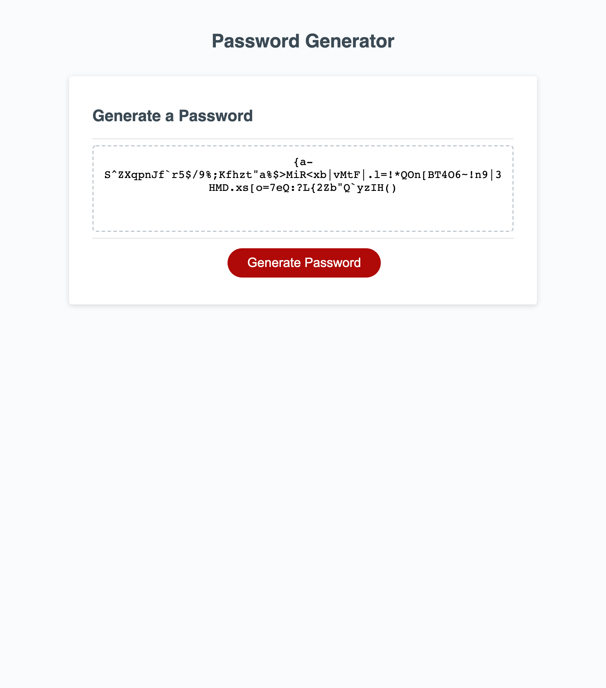

--------------------------------------

# Security-Password-Generator

The task was to refactor the code so that the output generates a random secure password based on criteria given. 

When presented with the first prompt it provided the user with the question for how long they wanted their password to be (between 8 and 128 characters). The user was then presented with selections (Cancel or  OK) for whether they wanted lower case, upper case, numbers, or symbols in their password. 

This is what the website looks like once complete :

--------------------------------------

## The Process 

Figuring out how to start the function was a bit challenging so I started by creating a variable for each of the required criteria and making a pop up appear for the first question which asks user how long the password should be. I realized that when "cancel" or an invalid number was input it would provide an undefined value in the text area where the password was to be displayed. Thus, I worked on writing code for when the pop up is cancelled or if the length did not fit the criteria. 

Once that was done the next questions would follow and log on the console if true or false depending on what the user selected. Again, since at least one selection had to be made there needed to be code in case user clicked "Cancel" for all character types using an if statement. 

I used "else if" statements for when the user does choose appropriate criteria. At this point I ran into some trouble combing the choices that the user chose. Using my Instructor's hint I realized how I could concatenate the user selections. I went through to write something for scenarios where 4, 3, 2 or just 1 type is picked and used the same logic all throughout. 

Then I needed a for loop for the random password selection. 
I had troubles understanding how I could use Math.floor that my Instructor mentioned, but used this website to explain it further :

* [GeeksforGeeks](https://www.geeksforgeeks.org/how-to-generate-a-random-password-using-javascript/)

* [W3Schools](https://www.w3schools.com/jsref/jsref_floor.asp)

Again, I was stuck figuring out how to have the selections appear as a single password. I used these website to explain the join and push methods which helped finish the for loop so that the password was generated as a singular string.

* [MDN Web Docs Join Method](https://developer.mozilla.org/en-US/docs/Web/JavaScript/Reference/Global_Objects/Array/join)

* [MDN Web Docs Push Method](https://developer.mozilla.org/en-US/docs/Web/JavaScript/Reference/Global_Objects/Array/push)

### Navigate my page

Here is a link to my deployed page that will create a password based on selections to the pop up questions. 

